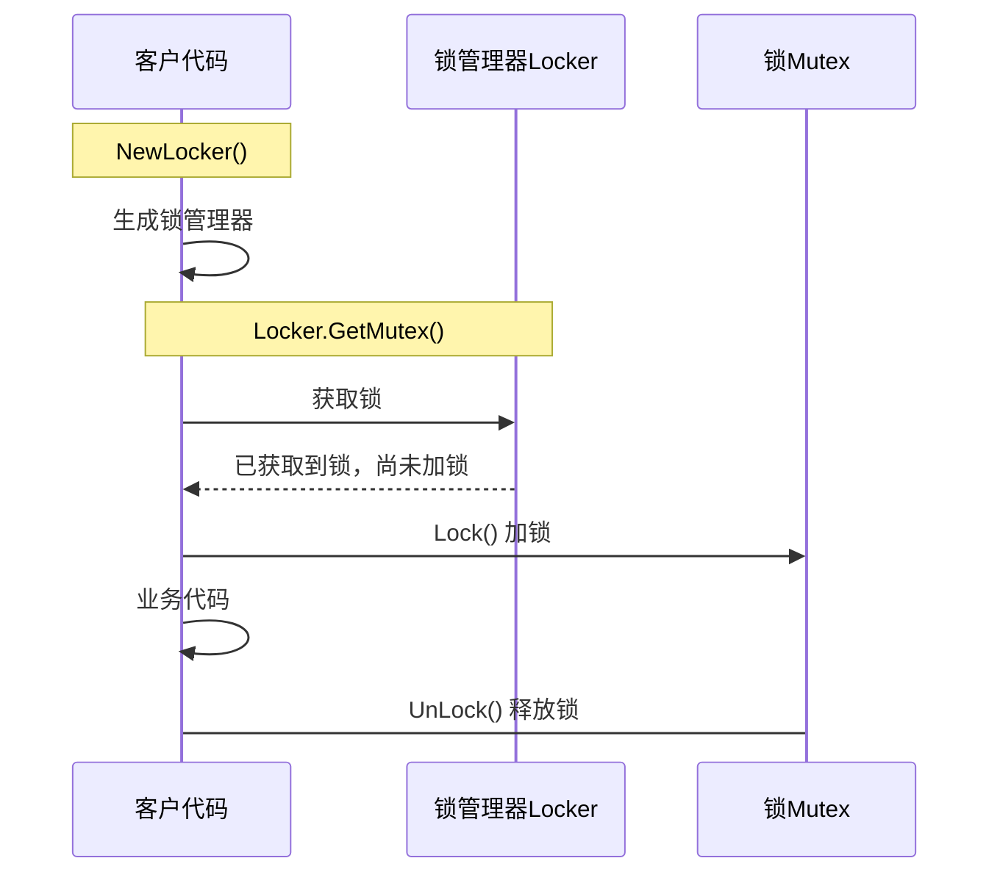

[TOC]

# 概述

本文介绍了redis分布式锁的特点和使用方法

# 版本

|   版本  |   修改时间    |   修改人 |   修改内容 |
| --- | --- | --- | --- |
|   |    |  |   |
|   v0.1    |   2021-03-16 10:50  |  everest   |   初步完成|

# 详述


## 特点

1. 支持自动续期
2. 具备锁持有者概念，单个锁只能被持有者释放或者超时自动释放
2. 可对多种行为进行自定义
    * 如果加锁失败(非redis错误,而是锁已经被持有)
        * 重试次数
        * 重试时间间隔
            * 固定
            * 变化
        * 取消持有者概念

## 用法

### 基本流程



### 注意

Lock 暴露了一个**Valid() 方法**，用于判断锁是否被继续持有，酌情使用


### GetMutex() 的参数

#### redsync.WithTries

```go
func WithTries(tries int) Option
```

未获取到锁时，重试次数

#### 重试间隔

```go
func WithRetryDelay(delay time.Duration) Option
func WithRetryDelayFunc(delayFunc DelayFunc)  Option
type DelayFunc func(tries int) time.Duration
```

每次重试时的休眠间隔


#### WithGenValueFunc

```go
func WithGenValueFunc(genValueFunc func() (string, error)) Option
```

redsync 使用 指定的**key+随机字符串**作为最终的key，由此实现了持有者的概念，可以指定一个永远返回相同的随机字符串方法，取消持有者概念